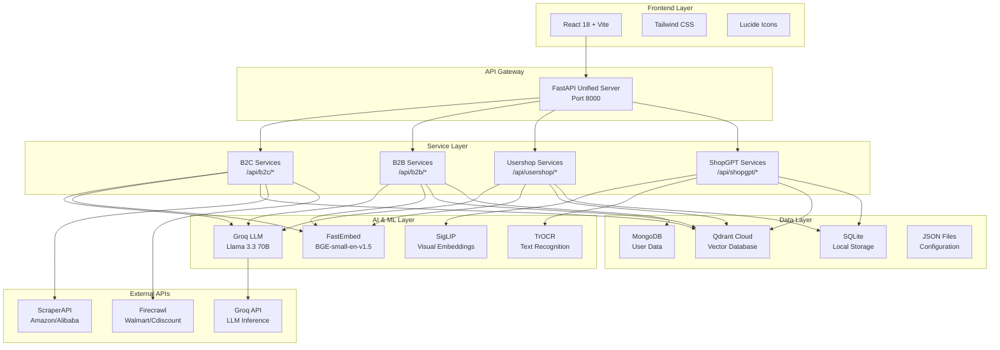

# 🚀 MinervaAI - Dinero Platform

<div align="center">


**Next-generation AI-powered shopping platform combining semantic search, real-time scraping, and intelligent recommendations**

[🌐 Live Demo](#) | [📖 Documentation](#documentation) | [🚀 Quick Start](#quick-start) | [🏗️ Architecture](#architecture)

</div>

---

## 📋 Table of Contents

- [🎯 Project Overview](#-project-overview)
- [🌟 Key Features](#-key-features)
- [🏗️ Architecture](#-architecture)
- [🔧 Technologies Used](#-technologies-used)
- [🗄️ Qdrant Integration](#️-qdrant-integration)
- [⚡ Quick Start](#-quick-start)
- [📚 Usage Examples](#-usage-examples)
- [🚀 Deployment](#-deployment)
- [🧪 Testing](#-testing)
- [📊 Performance](#-performance)
- [🤝 Contributing](#-contributing)
- [📄 License](#-license)

---

## 🎯 Project Overview

**Dinero Platform** is a comprehensive AI-powered shopping ecosystem that revolutionizes how users discover, compare, and purchase products across multiple marketplaces. The platform combines cutting-edge vector search technology with real-time web scraping and intelligent AI recommendations to deliver personalized shopping experiences.

### 🎯 Objectives

- **Semantic Understanding**: Move beyond keyword matching to understand user intent through vector embeddings
- **Real-time Intelligence**: Provide up-to-date product information through live scraping
- **Unified Experience**: Combine B2C marketplace, B2B supplier search, product management, and image-based search
- **AI-Powered Insights**: Generate marketing strategies, product comparisons, and personalized recommendations
- **Budget-Aware Shopping**: Help users make informed decisions within their financial constraints

### 🌍 Platform Links

- **Frontend**: `http://localhost:3000` (React Development Server)
- **Backend API**: `http://localhost:8000` (FastAPI Server)
- **API Documentation**: `http://localhost:8000/docs` (Swagger UI)
- **Health Check**: `http://localhost:8000/health`

---

## 🌟 Key Features

### 🛒 **Dinero Orbit (B2C Marketplace)**
- **Real-time Product Scraping** from Amazon, Alibaba, Walmart, and Cdiscount
- **Semantic Search** using vector embeddings for intent understanding
- **AI-Powered Recommendations** with personalized scoring
- **Marketing Strategy Generation** using Groq LLM
- **Price Comparison** across multiple platforms
- **Shopping Cart & Order Management**
- **Personal Marketplace** for saved products

### 🏢 **Dinero Prime (B2B Supplier Search)**
- **Verified Supplier Network** with detailed profiles
- **Bulk Pricing Optimization** for business purchases
- **JWT Authentication** for secure business accounts
- **Personalized Recommendations** based on search history
- **Cost Analysis** and procurement insights
- **Click Tracking** for analytics

### 🏪 **DineroShop (Product Management)**
- **CSV Import/Export** for bulk product management
- **Advanced Filtering** with multiple criteria
- **Product Comparison** with detailed analysis
- **Inventory Management** tools
- **Smart Categorization** using AI

### 📸 **Dinero VISION (Image Search)**
- **Visual Product Search** using SigLIP embeddings
- **OCR Text Extraction** from product images
- **Multi-modal Understanding** combining text and visual data
- **Image-to-Product Matching** across databases

---

## 🏗️ Architecture

### 🔄 System Architecture Diagram



### 📊 Request Flow

```
User Request → FastAPI Router → Service Handler → AI Processing → Database Query → Response
     ↓              ↓               ↓              ↓              ↓            ↓
  Frontend    Route Matching   Business Logic   Vector Search   Data Retrieval  JSON Response
```

---

## 🔧 Technologies Used

### 🖥️ **Backend Technologies**

| Technology | Version | Purpose |
|------------|---------|---------|
| **Python** | 3.10+ | Core programming language |
| **FastAPI** | ≥0.104.0 | High-performance web framework |
| **Uvicorn** | ≥0.24.0 | ASGI server |
| **Qdrant Client** | ≥1.7.0 | Vector database client |
| **FastEmbed** | ≥0.2.0 | Text embeddings (BGE model) |
| **Groq** | ≥0.4.0 | LLM API client |
| **Motor** | ≥3.3.0 | Async MongoDB driver |
| **Transformers** | ≥4.35.0 | HuggingFace models |
| **PyTorch** | ≥2.1.0 | Deep learning framework |
| **Sentence Transformers** | ≥2.2.0 | Semantic embeddings |

### 🌐 **Web Scraping & HTTP**

| Technology | Version | Purpose |
|------------|---------|---------|
| **HTTPX** | ≥0.25.0 | Async HTTP client |
| **Requests** | ≥2.31.0 | Sync HTTP client |
| **BeautifulSoup4** | ≥4.12.0 | HTML parsing |
| **LXML** | ≥4.9.0 | Fast XML/HTML parser |
| **Crawl4AI** | ≥0.3.0 | AI-powered web crawler |
| **Selenium** | ≥4.15.0 | Browser automation |
| **Firecrawl-py** | ≥0.0.5 | Firecrawl API client |

### 🖼️ **Image Processing & AI**

| Technology | Version | Purpose |
|------------|---------|---------|
| **Pillow** | ≥10.0.0 | Image manipulation |
| **PyTesseract** | ≥0.3.10 | OCR text extraction |
| **SigLIP** | Base-Patch16-224 | Visual embeddings (768-dim) |
| **TrOCR** | Microsoft | Text recognition from images |

### 🔐 **Security & Authentication**

| Technology | Version | Purpose |
|------------|---------|---------|
| **Python-JOSE** | ≥3.3.0 | JWT token handling |
| **Passlib** | ≥1.7.4 | Password hashing |
| **Bcrypt** | ≥4.0.0 | Secure password hashing |

### 📊 **Data Processing**

| Technology | Version | Purpose |
|------------|---------|---------|
| **Pandas** | ≥2.0.0 | CSV processing & data analysis |
| **NumPy** | ≥1.24.0 | Numerical operations |
| **Pydantic** | ≥2.5.0 | Data validation |
| **Python-dotenv** | ≥1.0.0 | Environment management |

### 🎨 **Frontend Technologies**

| Technology | Version | Purpose |
|------------|---------|---------|
| **React** | 18+ | UI framework |
| **Vite** | Latest | Build tool & dev server |
| **Tailwind CSS** | Latest | Utility-first CSS framework |
| **Lucide React** | Latest | Icon library |
| **Axios** | Latest | HTTP client |
| **React Router** | Latest | Client-side routing |

---

## 🗄️ Qdrant Integration

### 🔍 **Vector Database Architecture**

MinervaAI leverages **Qdrant Cloud** as its primary vector database for semantic search and similarity matching. Here's how Qdrant is integrated across different services:

#### 📚 **Collections Structure**

```python
# Collection Configuration
COLLECTIONS = {
    "minerva_b2b_premium": {
        "vectors": {
            "size": 384,  # FastEmbed BGE-small-en-v1.5
            "distance": "Cosine"
        },
        "purpose": "B2B supplier embeddings",
        "persistence": "Permanent"
    },
    "minerva_usershop": {
        "vectors": {
            "size": 384,  # FastEmbed BGE-small-en-v1.5
            "distance": "Cosine"
        },
        "purpose": "Product catalog embeddings",
        "persistence": "Permanent"
    },
    "temp_search_*": {
        "vectors": {
            "size": 384,  # FastEmbed BGE-small-en-v1.5
            "distance": "Cosine"
        },
        "purpose": "Real-time B2C search",
        "persistence": "Ephemeral (deleted after use)"
    },
    "shopgpt_*": {
        "vectors": {
            "size": 768,  # SigLIP visual embeddings
            "distance": "Cosine"
        },
        "purpose": "Image-based product search",
        "persistence": "Permanent"
    }
}
```

#### 🔄 **Integration Workflow**

1. **Embedding Generation**
   ```python
   # Text embeddings using FastEmbed
   from fastembed import TextEmbedding
   
   embedding_model = TextEmbedding("BAAI/bge-small-en-v1.5")
   embeddings = embedding_model.embed(["product description"])
   ```

2. **Vector Storage**
   ```python
   # Store in Qdrant
   from qdrant_client import QdrantClient
   
   client = QdrantClient(url=QDRANT_URL, api_key=QDRANT_API_KEY)
   client.upsert(
       collection_name="minerva_b2b_premium",
       points=[{
           "id": product_id,
           "vector": embedding,
           "payload": product_metadata
       }]
   )
   ```

3. **Semantic Search**
   ```python
   # Query similar products
   results = client.query_points(
       collection_name="minerva_b2b_premium",
       query=query_embedding,
       limit=20,
       score_threshold=0.7
   )
   ```

#### 🎯 **Service-Specific Usage**

**B2C Marketplace (Dinero Orbit)**:
- Creates temporary collections for real-time search
- Stores scraped products with embeddings
- Performs similarity search for recommendations
- Automatically cleans up ephemeral data

**B2B Supplier Search (Dinero Prime)**:
- Maintains persistent supplier database
- Enables semantic supplier matching
- Supports personalized recommendations
- Tracks search patterns for optimization

**Product Management (DineroShop)**:
- Stores user product catalogs
- Enables advanced product comparison
- Supports bulk operations via CSV
- Maintains product relationships

**Image Search (Dinero VISION)**:
- Uses SigLIP for visual embeddings (768-dim)
- Combines text and image vectors
- Supports multi-modal search queries
- Enables image-to-product matching

#### ⚡ **Performance Optimizations**

- **Batch Processing**: Embeddings generated in batches for efficiency
- **Async Operations**: Non-blocking database operations
- **Connection Pooling**: Reused connections for better performance
- **Memory Management**: Ephemeral collections for temporary data
- **Indexing Strategy**: Optimized for cosine similarity search

---

## ⚡ Quick Start

### 📋 **Prerequisites**

- **Python 3.10+** installed
- **Node.js 16+** and npm/yarn
- **Git** for cloning the repository
- **Qdrant Cloud** account (free tier available)
- **Groq API** key (free tier available)

### 🚀 **Installation Steps**

#### 1️⃣ **Clone Repository**
```bash
git clone https://github.com/your-username/MinervaAI_USECASE2.git
cd MinervaAI_USECASE2
```

#### 2️⃣ **Backend Setup**
```bash
cd backend

# Create virtual environment
python -m venv venv

# Activate virtual environment
# Windows:
venv\Scripts\activate
# macOS/Linux:
source venv/bin/activate

# Install dependencies
pip install -r requirements.txt
```

#### 3️⃣ **Environment Configuration**
Create a `.env` file in the `backend/` directory:

```env
# ==================== QDRANT CLOUD ====================
QDRANT_URL=https://your-cluster.qdrant.io
QDRANT_API_KEY=your_qdrant_api_key
QDRANT_COLLECTION_B2BPREMIUM=minerva_b2b_premium
QDRANT_COLLECTION_USERSHOP=minerva_usershop

# ==================== GROQ API ====================
GROQ_API_KEY=gsk_your_groq_api_key
GROQ_MODEL=llama-3.3-70b-versatile

# ==================== SCRAPING APIS ====================
SCRAPERAPI_KEY_AMAZON=your_amazon_scraper_key
SCRAPERAPI_KEY_ALIBABA=your_alibaba_scraper_key
FIRECRAWL_API_KEY_WALMART=your_walmart_firecrawl_key
FIRECRAWL_API_KEY_CDISCOUNT=your_cdiscount_firecrawl_key

# ==================== MONGODB (B2B) ====================
MONGO_URI=mongodb://localhost:27017/minerva_b2b

# ==================== JWT SECURITY ====================
SECRET_KEY=your_super_secret_jwt_key_here
JWT_ALGORITHM=HS256
JWT_ACCESS_TOKEN_EXPIRE_MINUTES=30
```

#### 4️⃣ **Frontend Setup**
```bash
cd ../frontend

# Install dependencies
npm install
# or
yarn install
```

#### 5️⃣ **Start Services**

**Option A: Quick Start (Windows)**
```bash
cd backend
start_unified.bat
```

**Option B: Manual Start**
```bash
# Terminal 1: Backend
cd backend
python main_unified.py

# Terminal 2: Frontend
cd frontend
npm run dev
```

#### 6️⃣ **Verify Installation**
- **Frontend**: http://localhost:3000
- **Backend API**: http://localhost:8000
- **API Docs**: http://localhost:8000/docs
- **Health Check**: http://localhost:8000/health

---

## 📚 Usage Examples

### 🛒 **B2C Marketplace Search**

```javascript
// Search for products across multiple platforms
const searchProducts = async () => {
  const response = await fetch('http://localhost:8000/api/b2c/search/semantic', {
    method: 'POST',
    headers: { 'Content-Type': 'application/json' },
    body: JSON.stringify({
      query: "gaming laptop RTX 4070",
      use_amazon: true,
      use_alibaba: true,
      use_walmart: true,
      use_cdiscount: true,
      max_results: 20
    })
  });
  
  const data = await response.json();
  console.log(`Found ${data.products.length} products`);
  console.log('AI Summary:', data.summary);
};
```

### 🏢 **B2B Supplier Search**

```javascript
// Login and search for suppliers
const searchSuppliers = async () => {
  // 1. Login
  const loginResponse = await fetch('http://localhost:8000/api/b2b/auth/login', {
    method: 'POST',
    headers: { 'Content-Type': 'application/json' },
    body: JSON.stringify({
      email: "business@example.com",
      password: "secure_password"
    })
  });
  
  const { access_token } = await loginResponse.json();
  
  // 2. Search suppliers
  const searchResponse = await fetch('http://localhost:8000/api/b2b/search', {
    method: 'POST',
    headers: { 
      'Content-Type': 'application/json',
      'Authorization': `Bearer ${access_token}`
    },
    body: JSON.stringify({
      product_name: "office chairs",
      quantity: 100,
      max_price: 150
    })
  });
  
  const suppliers = await searchResponse.json();
  console.log('Best supplier:', suppliers.best_supplier);
};
```

### 🏪 **Product Management**

```javascript
// Get personalized recommendations
const getRecommendations = async () => {
  const response = await fetch('http://localhost:8000/api/usershop/recommend', {
    method: 'POST',
    headers: { 'Content-Type': 'application/json' },
    body: JSON.stringify({
      name: "wireless headphones",
      min_price: 50,
      max_price: 200,
      category: "Electronics",
      sort_by: "relevance"
    })
  });
  
  const recommendations = await response.json();
  console.log(`Found ${recommendations.products.length} recommendations`);
};
```

### 📸 **Image-Based Search**

```javascript
// Upload image for product search
const searchByImage = async (imageFile) => {
  const formData = new FormData();
  formData.append('image', imageFile);
  
  const response = await fetch('http://localhost:8000/api/shopgpt/search', {
    method: 'POST',
    body: formData
  });
  
  const results = await response.json();
  console.log('Similar products found:', results.products);
};
```

### 🎯 **Marketing Strategy Generation**

```javascript
// Generate AI marketing strategy
const generateStrategy = async () => {
  const response = await fetch('http://localhost:8000/api/b2c/marketing', {
    method: 'POST',
    headers: { 'Content-Type': 'application/json' },
    body: JSON.stringify({
      product_name: "Wireless Gaming Mouse",
      product_description: "High-precision wireless gaming mouse with RGB lighting"
    })
  });
  
  const strategy = await response.json();
  console.log('Marketing Strategy:', strategy.strategy);
};
```

### 📊 **Health Check & Monitoring**

```bash
# Check system health
curl http://localhost:8000/health

# Response:
{
  "status": "healthy",
  "services": {
    "b2c": "operational",
    "b2b": "operational", 
    "usershop": "operational",
    "shopgpt": "operational"
  },
  "database": {
    "qdrant": "connected",
    "mongodb": "connected"
  },
  "timestamp": "2024-01-15T10:30:00Z"
}
```


## 🧪 Testing

### 🔍 **API Testing**

```bash
# Install testing dependencies
pip install pytest httpx pytest-asyncio

# Run tests
pytest tests/ -v
```

### 📊 **Performance Testing**

```bash
# Load testing with Apache Bench
ab -n 100 -c 10 http://localhost:8000/health

# Memory profiling
python -m memory_profiler main_unified.py
```

### 🐛 **Debug Mode**

```bash
# Start with debug logging
DEBUG=true python main_unified.py
```

---

## 📊 Performance

### ⚡ **Benchmarks**

| Metric | B2C Search | B2B Search | Usershop | ShopGPT |
|--------|------------|------------|----------|---------|
| **Response Time** | 5-15s | 1-3s | 2-5s | 3-8s |
| **Throughput** | 10 req/s | 50 req/s | 30 req/s | 15 req/s |
| **Memory Usage** | 200-300MB | 100-150MB | 150-200MB | 300-400MB |
| **Startup Time** | 2-3s | 1-2s | 3-5s | 2-3s |

### 🎯 **Optimization Tips**

- **Caching**: Implement Redis for frequently accessed data
- **Database Indexing**: Optimize Qdrant collections for your use case
- **Batch Processing**: Group similar requests for better efficiency
- **CDN**: Use CDN for static assets and images
- **Load Balancing**: Scale horizontally with multiple instances

### 👥 **Contributors**

- [**Mariem Jlassi**](https://github.com/Maryem-Jlassi) - AI Engineering student 
- [**Wassim Guesmi**](https://github.com/zaatar1x) - DATA SCIENCE SUTDENT
- [**Rahma Ben Hedhili**](https://github.com/rahmabenhdhili) - DATA SCIENCE SUTDENT
- [**Islem Labidi**](https://github.com/islemlabidi0) - DATA SCIENCE SUTDENT


<div align="center">

**Making smart shopping accessible for everyone** 🛒✨

[🔝 Back to Top](#-minervaai---dinero-platform)

</div>


